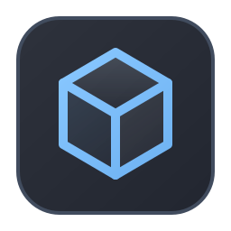

# TextFoundryEngine

[](https://github.com/Artem535/TextFoundryEngine/actions/workflows/ci.yml)
[](LICENSE)

The deterministic C++ domain engine behind [TextFoundry](https://github.com/Artem535/TextFoundry): reusable, versioned text `Block`s assembled into `Composition`s and rendered deterministically. Extracted into its own repository so it can be consumed as a standalone C++ library by more than one project.

## What this is

TextFoundry models prompts (or any structured, reusable text) as explicit versioned assets instead of copy-pasted strings:

- **`Block`** — a reusable, versioned text fragment with a `{{param}}` template, defaults, tags, and metadata.
- **`Composition`** — an ordered assembly of fragments (`BlockRef`, static text, separators) that forms a complete document.
- **`Version`** — every publish of a `Block` or `Composition` creates a new, immutable, traceable version.
- **`Renderer`** — a pure, stateless function that turns a published `Composition` into final text. It never performs I/O or calls an LLM — rendering is deterministic by construction.
- **`Engine`** — ties the above together with storage-backed repositories and publish/version workflows.

This repository is the reference application's engine, factored out so a second C++ consumer (or more) can link it directly without pulling in TextFoundry's GUI, CLI, or AI-integration code.

## Two targets

The library is split so a consumer that doesn't need storage doesn't pay for it:

| Target | Contents | Depends on |
|---|---|---|
| `textfoundry_core` | `Block`, `Composition`, `Fragment`, `Renderer`, `Engine` (minus `FullInit`), `Version`, `Error`, logging | `ctre`, `spdlog`, `reflectcpp`, `fmt` — no storage backend |
| `textfoundry_objectbox_store` | ObjectBox-backed `IBlockRepository`/`ICompositionRepository`, and `Engine::FullInit()`, which wires them up | `textfoundry_core` + ObjectBox |

`Engine::FullInit()` is deliberately isolated in its own translation unit (`tf/engine_objectbox_init.cc`) so that linking `textfoundry_core` alone never pulls in unresolved ObjectBox symbols, even though `FullInit()` is a normal member of `Engine` — static linking pulls in a whole `.o` per referenced symbol, so keeping it out of `engine.cc` keeps `textfoundry_core` genuinely storage-free.

### Build options

| Option | Default | Effect |
|---|---|---|
| `TEXTFOUNDRY_ENGINE_BUILD_OBJECTBOX_STORE` | `ON` | Builds `textfoundry_objectbox_store` and fetches ObjectBox. Turn `OFF` to consume just `textfoundry_core` and supply your own repository implementations — no ObjectBox fetch or build at all. |
| `TEXTFOUNDRY_ENGINE_BUILD_TESTS` | `ON` | Builds this repository's own test suite (`core_tests`, `doctest`-based). Turn `OFF` when consuming via `FetchContent` and your project doesn't already depend on `doctest`. |

## Using it via FetchContent

```cmake
include(FetchContent)

FetchContent_Declare(
  textfoundry_engine
  GIT_REPOSITORY https://github.com/Artem535/TextFoundryEngine.git
  GIT_TAG v0.2.1
)
FetchContent_MakeAvailable(textfoundry_engine)

target_link_libraries(your_target PRIVATE textfoundry_core)
# or, if you need the ObjectBox-backed repositories:
# target_link_libraries(your_target PRIVATE textfoundry_objectbox_store)
```

Pin `GIT_TAG` to a released tag rather than `main` — tags are the stable integration point consumers should build against. If your project doesn't already depend on `doctest`, also set `TEXTFOUNDRY_ENGINE_BUILD_TESTS OFF` before `FetchContent_MakeAvailable`; if you don't need the storage backend, set `TEXTFOUNDRY_ENGINE_BUILD_OBJECTBOX_STORE OFF` too, and ObjectBox is never fetched.

A package config (`TextFoundryConfig.cmake`, namespace `TextFoundry::`) is also installed for consumers that prefer `find_package(TextFoundry)` over `FetchContent`.

## Building standalone

Requires CMake 3.20+, a C++23 compiler, and [vcpkg](https://github.com/microsoft/vcpkg) (`VCPKG_ROOT` set in the environment).

```bash
cmake --preset vcpkg-rel
cmake --build build-rel --parallel
ctest --test-dir build-rel --output-on-failure
```

## Consumers

- [TextFoundry](https://github.com/Artem535/TextFoundry) — the reference desktop/CLI application this engine was extracted from; consumes both targets.
- CppWiki — a second, independent C++ consumer of `textfoundry_core` (in progress), which motivated the `textfoundry_core`/`textfoundry_objectbox_store` split and the `TEXTFOUNDRY_ENGINE_BUILD_*` options above.

## License

MIT — see [LICENSE](LICENSE).
